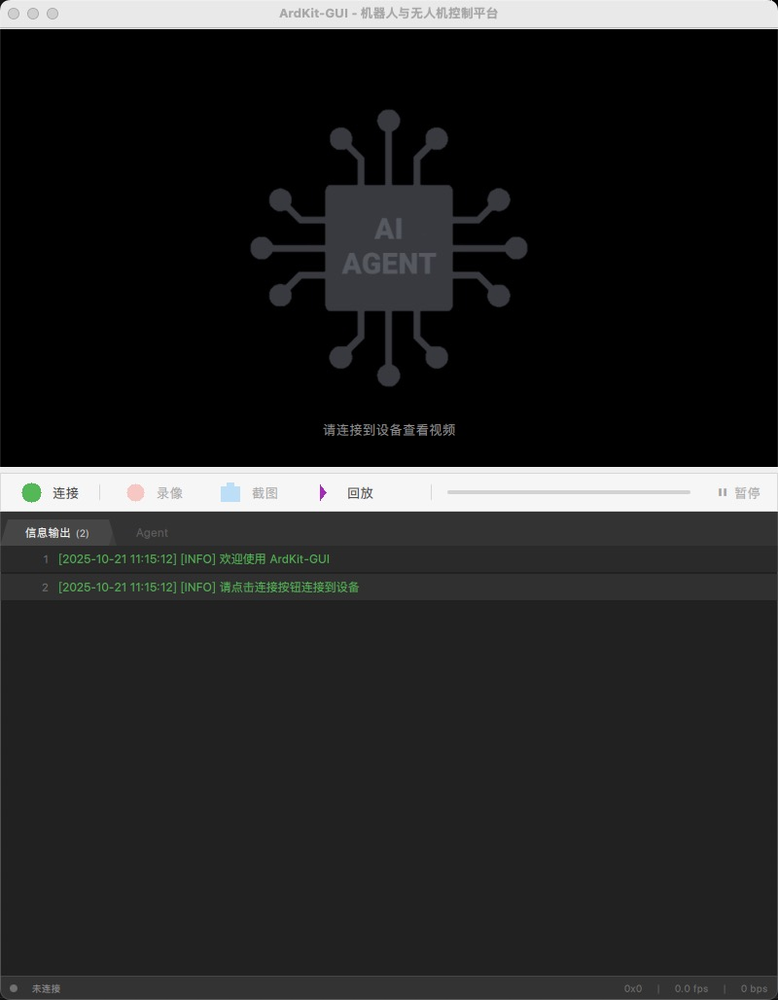

# ArdKit-GUI

基于 Qt Quick 的机器人与无人机控制平台

## 项目简介

ArdKit-GUI 是一个跨平台的桌面应用程序，用于：
- **图传显示**：实时显示机器人/无人机的视频流
- **设备连接**：支持 WiFi、串口、USB 多种连接方式
- **录像与截图**：记录重要时刻
- **信息监控**：实时查看设备输出信息

## 界面预览



## 功能特性

### 主窗口布局
- **菜单栏**：文件、连接、视频、帮助等标准菜单
- **工具栏**：快速访问常用功能（连接/断开、录像、截图、配置）
- **视频显示区域**：自适应 16:9 或 4:3 视频比例
- **信息控制台**：类似终端的消息输出，支持颜色标记和滚动查看

### 核心功能
- ✅ 多种连接方式（WiFi、串口、USB）
- ✅ 实时视频流显示
- ✅ 视频录制功能
- ✅ 屏幕截图
- ✅ 实时信息日志（最多 1000 条可配置）
- ✅ 配置管理（自动保存/加载）

## 技术栈

- **UI 框架**：Qt Quick (QML)
- **编程语言**：C++17
- **构建工具**：CMake 3.16+
- **支持平台**：macOS, Windows, Linux

## 系统要求

### 开发环境
- Qt 5.15+ 或 Qt 6.x
- CMake 3.16+
- C++17 编译器（GCC 7+, Clang 5+, MSVC 2017+）

### 运行环境
- 支持 OpenGL 的显卡
- 建议内存：4GB+

## 构建和运行

### 重要：构建目录管理

**所有构建文件必须在 build 目录中！**

本项目强制使用外部构建（out-of-source build），所有构建产物（包括 CMake 缓存、MOC/UIC/RCC 生成文件、编译产物等）都会自动放在 `build/` 目录中。这样可以：
- ✅ 保持源码目录清洁
- ✅ 方便清理构建（直接删除 build 目录）
- ✅ 避免误提交构建文件到版本控制

如果尝试在源码目录直接运行 `cmake .`，会收到错误提示。

### 1. 克隆仓库
```bash
git clone <repository-url>
cd ArdKit-GUI
```

### 2. 构建项目

#### Linux / macOS
```bash
# 创建并进入构建目录
mkdir build && cd build

# 配置项目
cmake -DCMAKE_BUILD_TYPE=Release ..

# 编译（使用多核）
cmake --build . -j$(nproc)
```

#### Windows (MSVC)
```powershell
# 创建并进入构建目录
mkdir build
cd build

# 配置项目
cmake -G "Visual Studio 16 2019" ..

# 编译
cmake --build . --config Release
```

### 3. 运行应用
```bash
# 从 build 目录运行
# Linux/macOS
./bin/ArdKit-GUI

# Windows
.\bin\Release\ArdKit-GUI.exe

# 或从项目根目录运行
# Linux/macOS
./build/bin/ArdKit-GUI

# Windows
.\build\bin\Release\ArdKit-GUI.exe
```

### 4. 清理构建
```bash
# 完全清理：删除整个 build 目录
rm -rf build

# 然后可以重新构建
mkdir build && cd build
cmake ..
cmake --build .
```

## 项目结构

```
ArdKit-GUI/
├── build/                  # 构建目录（.gitignore 已忽略）
│   ├── bin/                # 可执行文件输出
│   ├── lib/                # 库文件输出
│   ├── moc/                # Qt MOC 生成文件
│   ├── uic/                # Qt UIC 生成文件
│   └── rcc/                # Qt RCC 生成文件
├── src/                    # C++ 源代码
│   ├── main.cpp            # 应用程序入口
│   ├── videohandler.h/cpp  # 视频处理模块
│   ├── connectionmanager.h/cpp  # 连接管理模块
│   ├── configmanager.h/cpp # 配置管理模块
│   └── messagelogger.h/cpp # 消息日志模块
├── qml/                    # QML 界面文件
│   ├── main.qml            # 主窗口
│   └── components/         # UI 组件
│       ├── ToolBar.qml     # 工具栏组件
│       ├── VideoDisplay.qml # 视频显示组件
│       └── MessageConsole.qml # 消息控制台组件
├── resources/              # 资源文件
│   ├── icons/              # 图标资源
│   └── images/             # 图片资源
├── CMakeLists.txt          # CMake 构建配置
├── resources.qrc           # Qt 资源文件
├── README.md               # 项目说明文档
├── CLAUDE.md               # Claude Code 开发指南
└── .gitignore              # Git 忽略文件
```

**注意**：`build/` 目录由 CMake 构建时自动创建，包含所有构建产物，已在 `.gitignore` 中排除，不会提交到版本控制。

## 开发指南

### 添加新功能

1. **C++ 后端**：在 `src/` 目录创建新的类
2. **QML 界面**：在 `qml/components/` 添加新组件
3. **资源文件**：将资源添加到 `resources.qrc`

### 代码规范

- C++ 类名使用大驼峰命名（PascalCase）
- QML 文件名使用大驼峰命名
- 变量和函数名使用小驼峰命名（camelCase）
- 私有成员变量使用 `m_` 前缀

### 信号槽连接

所有 C++ 和 QML 之间的通信通过 Qt 的信号槽机制：
```cpp
// C++ 中暴露属性
Q_PROPERTY(bool isConnected READ isConnected NOTIFY isConnectedChanged)

// QML 中使用
Text {
    text: connectionManager.isConnected ? "已连接" : "未连接"
}
```

## 待实现功能

以下功能已预留接口，等待实现：

- [ ] 实际的视频解码和渲染（当前仅为占位符）
- [ ] TCP/UDP/串口通信实现
- [ ] 视频录制编码器集成
- [ ] MAVLink 协议支持
- [ ] 遥控器输入支持
- [ ] 飞行数据可视化

## 常见问题

### Q: 编译时找不到 Qt
**A**: 确保设置了 `CMAKE_PREFIX_PATH` 环境变量指向 Qt 安装目录：
```bash
export CMAKE_PREFIX_PATH=/path/to/Qt/6.x.x/gcc_64
```

### Q: QML 运行时错误
**A**: 检查是否正确注册了 C++ 类型：
```cpp
qmlRegisterType<YourClass>("ModuleName", 1, 0, "YourClass");
```

### Q: 视频不显示
**A**: 当前版本视频显示为占位符，需要集成实际的视频解码库（如 FFmpeg）。

## 贡献

欢迎提交 Issue 和 Pull Request！

## 许可证

[待添加许可证信息]

## 联系方式

- 项目主页：[待添加]
- 问题反馈：[待添加]

---

**注意**：本项目当前处于开发阶段，部分功能（如视频解码、网络通信）需要进一步实现。
